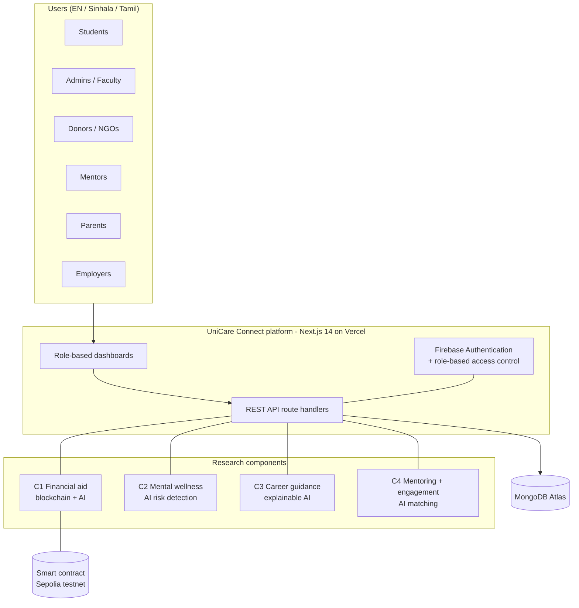
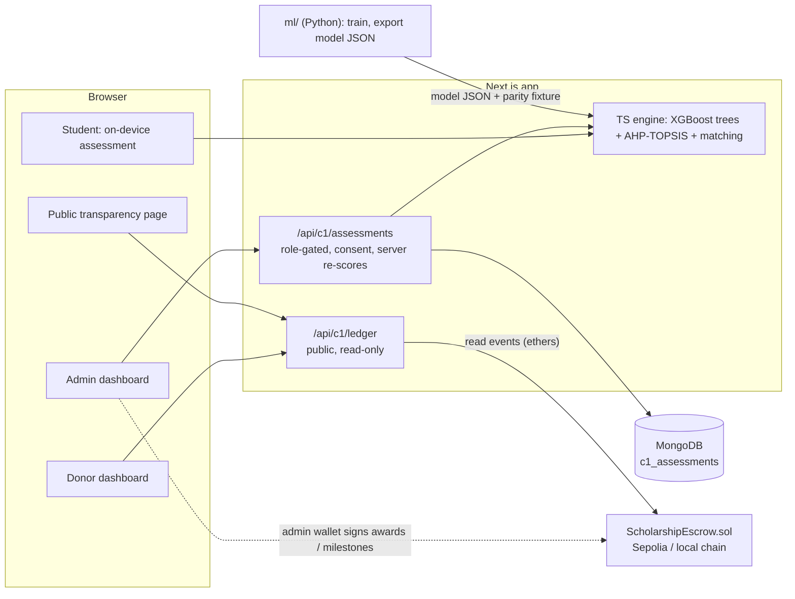
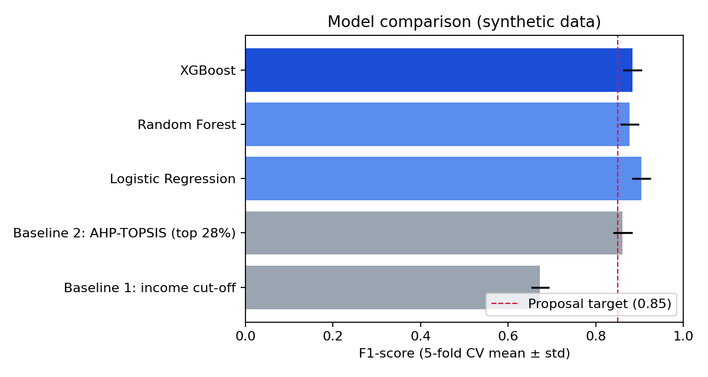
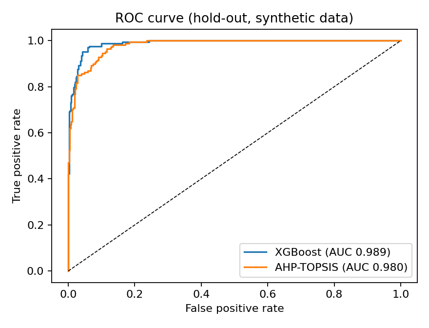
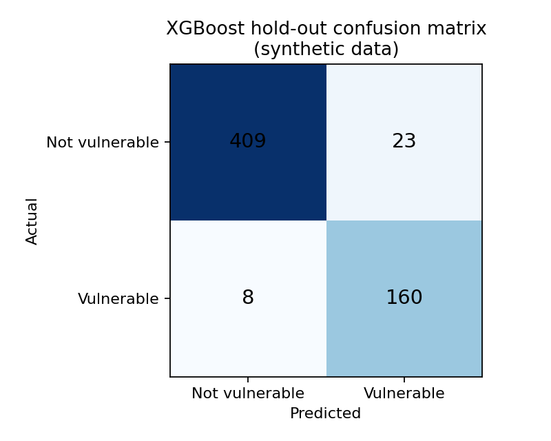

# UniCare Connect

**A multilingual, role-based student support platform for Sri Lankan universities**

IT4010 Research Project - Group **J26-IT-345** - SLIIT, Faculty of Computing, Department of Information Technology
Specialization: **IT** - Research cluster: **SST (Software Systems & Technologies)** - Industry vertical: EdTech
Supervisor: Prof. Dasuni Nawinna - Co-supervisor: Ms. Aruni Premarathne

> **Honesty note.** The anonymised SLIIT student dataset requested from the supervisors has not been received yet. Every machine-learning number in this repository comes from **clearly labelled synthetic data**: it shows that the pipelines work end to end, **not** how accurate they are on real students. Contract measurements (gas, tests, coverage, static analysis) are real. Each result below says which kind it is.

---

## Contents

1. [The research at a glance](#1-the-research-at-a-glance)
2. [Team and components](#2-team-and-components)
3. [Platform architecture](#3-platform-architecture)
4. [Repository structure](#4-repository-structure)
5. [Quick start](#5-quick-start)
6. [Component C1 - Transparent, AI-assisted financial aid](#6-component-c1---transparent-ai-assisted-financial-aid) (implemented)
7. [Components C2, C3, C4](#7-components-c2-c3-c4) (structure ready, work in progress)
8. [How to add a component to the platform](#8-how-to-add-a-component-to-the-platform)
9. [Testing and quality](#9-testing-and-quality)
10. [Ethics, privacy and AI-use disclosure](#10-ethics-privacy-and-ai-use-disclosure)
11. [Project timeline and assessment](#11-project-timeline-and-assessment)
12. [Troubleshooting](#12-troubleshooting)
13. [Documentation map](#13-documentation-map)

---

## 1. The research at a glance

**Problem.** Sri Lankan university students face fragmented access to financial aid, career guidance, mentorship and wellness support. Scholarship news travels by notice boards and WhatsApp; screening is manual and inconsistent; donors cannot verify where money went; rural students are shut out by English-only, high-bandwidth platforms; and universities have no consolidated view of student needs. The consequences are missed opportunities, stress and widening inequality (SDG 3, 4, 8, 10, 16).

**Gap.** No existing platform in Sri Lanka integrates financial aid, career, mentoring and wellness for seven stakeholder roles in one multilingual system with intelligent, *explainable* recommendation. Prior work treats each service, and each technology (blockchain transparency, AI need-assessment, recommender systems), separately.

**Main objective.** To design, develop and evaluate a centralised, multilingual, role-based student support platform (UniCare Connect) that improves student access to financial aid, mentorship, career guidance and wellness resources in Sri Lankan universities.

**Method.** Design Science Research (DSR): problem identification -> solution objectives -> design and development -> demonstration -> evaluation against baselines and metrics -> communication. Agile, iterative implementation on a shared platform.

**Scope of the pilot.** SLIIT Year 3 and Year 4 IT undergraduates, expanding to other Sri Lankan universities afterwards.

**Novelty (per component).** See the table in section 2: each member contributes an AI/analytics component with its own research question, baselines and evaluation, all integrated through one role-based platform.

## 2. Team and components

| Component | Owner | Research focus | Status in this repository |
| --- | --- | --- | --- |
| **C1** | Wijesinghe S K (IT23152700) - group leader | Blockchain-based transparent financial aid, AI financial-vulnerability assessment, AI scholarship matching, admin and donor monitoring | **Implemented** (section 6) |
| **C2** | D. G. A. Indeepa (IT23273412) | AI-powered mental wellness support and early risk detection: bounded conversational assistant, PHQ-9 / GAD-7 self-assessments, optional facial-expression analysis, mood journaling, quality-aware multimodal fusion, confidential counselor referral | Folder structure ready (section 7) |
| **C3** | K. K. T. C. Kamburugoda (IT23155084) | Explainable AI career guidance: NLP over Sri Lankan IT job advertisements, CV and questionnaire analysis, career-path recommendation with readiness scores, skill-gap prioritisation, Gap-to-Action knowledge graph | Folder structure ready (section 7) |
| **C4** | L. L. E. Harshana (IT23195202) | AI mentor matching and student engagement: dynamic multi-criteria mentor matching, activity recommendation, privacy-aware parent/guardian communication, peer collaboration, engagement and mentorship analytics | Folder structure ready (section 7) |

The platform itself (authentication, role dashboards, notifications, multilingual UI) started as the IT3040 IT Project Management project and is the shared base that all four components plug into.

## 3. Platform architecture



Every component follows the same pattern (see section 8): a dashboard section per role, role-gated API routes, a typed library under `src/lib/<component>`, consent-first data handling, a demo mode that works without the database, English / Sinhala / Tamil text, and tests.

## 4. Repository structure

```
UniCare Connect/
├── README.md                     <- this file (the single project README)
├── .env.example                  environment variable names (no secrets)
├── src/                          Next.js 14 web application
│   ├── app/                      pages and API routes
│   │   ├── api/c1/               C1 endpoints (ledger, assessments)
│   │   ├── api/c2|c3|c4/         reserved for C2, C3, C4 (empty)
│   │   ├── transparency/         C1 public audit ledger page
│   │   └── aid-assessment/       C1 on-device assessment page
│   ├── components/
│   │   ├── c1/                   C1 UI (ledger explorer, assessment tool)
│   │   ├── c2|c3|c4/             reserved (empty)
│   │   ├── admin/ donor/ ...     existing role dashboards
│   │   └── dashboard/student/    existing student dashboard sections
│   └── lib/
│       ├── c1/                   C1 model runtime, matching, ledger, i18n, validation
│       ├── c2|c3|c4/             reserved (empty)
│       └── ...                   auth, MongoDB, RBAC, demo stores
├── blockchain/                   C1 - Hardhat project: contracts, tests, deploy/benchmark scripts
├── ml/                           research code and data (never commit real data)
│   ├── *.py, data/               C1 - synthetic data, AHP-TOPSIS, XGBoost training
│   ├── c2/                       C2 - data/ notebooks/ models/ evaluation/ src/{text-sentiment, facial-expression, fusion}
│   ├── c3/                       C3 - data/ notebooks/ models/ evaluation/ src/{job-ad-nlp, skill-extraction, knowledge-graph, recommender}
│   └── c4/                       C4 - data/ notebooks/ models/ evaluation/ src/{mentor-matching, activity-recommendation, analytics}
├── tests/
│   ├── unit/ integration/ fixtures/     C1 tests live here; c2/ c3/ c4/ sub-folders reserved
├── scripts/                      evaluation scripts (c1 implemented; c2|c3|c4 reserved)
└── docs/
    ├── openapi.yaml              API reference
    ├── c1/ c2/ c3/ c4/           per member: proposal/ evidence/ reports/
    └── shared/                   logbook/ ethics/ checklists/ presentations/
```

Under every `ml/cN/data/` there are `raw/` and `private/` folders whose **contents are git-ignored** (only `.gitkeep` is tracked). Real or sensitive data (wellness, facial images, CVs, student records) must live there and never be committed. Empty folders are kept in Git with a `.gitkeep` file.

## 5. Quick start

Requires Node.js 20+ (tested on 22) and npm. Python 3.11+ is only needed for the AI pipelines.

```bash
npm install
cp .env.example .env.local      # NEXT_PUBLIC_DEMO_MODE=true by default (no database or Firebase needed)
npm run dev                     # http://localhost:3000
```

Public C1 pages that work without logging in: `/aid-assessment` (private, on-device need check) and `/transparency` (blockchain audit ledger; a local simulation until a testnet address is configured). Role dashboards (`/dashboard/<role>`) need Firebase sign-in and MongoDB (see section 12).

| Command | Purpose |
| --- | --- |
| `npm run dev` / `build` / `start` | Develop / production build / serve |
| `npm run lint` / `typecheck` | ESLint / `tsc --noEmit` |
| `npm test` | Jest unit, component and API tests (78 tests) |
| `npm run test:e2e` | Playwright end-to-end tests |
| `npm run c1:ml` | Regenerate C1 synthetic data and retrain the vulnerability model |
| `npm run c1:eval-matching` | C1 scholarship-matching evaluation (NDCG) |
| `npm run c1:chain:test` | C1 contract tests |

**Environment variables** (see `.env.example`): `NEXT_PUBLIC_DEMO_MODE`, `MONGODB_URI`, `MONGODB_DB_NAME`, `NEXT_PUBLIC_FIREBASE_*`, `FIREBASE_WEB_API_KEY`, and the optional C1 ledger settings `C1_RPC_URL`, `C1_ESCROW_ADDRESS`, `C1_DEPLOY_BLOCK`. Secrets live only in `.env.local` / `blockchain/.env` (both git-ignored).

---

## 6. Component C1 - Transparent, AI-assisted financial aid

**Research question.** Can an AI model that assesses multidimensional financial vulnerability, combined with blockchain escrow and milestone-based disbursement, make scholarship administration fairer and more transparent than manual, threshold-based screening?

**Gap.** Blockchain scholarship transparency and AI need-assessment exist separately; none combines both for Sri Lankan higher education with multilingual access.

### 6.1 What is implemented

| Capability | Where | Status |
| --- | --- | --- |
| Solidity escrow: campaigns, awards, **milestone-based automatic release**, revoke, pause, pull-payment fallback | `blockchain/contracts/ScholarshipEscrow.sol` | Done - 26 tests, 100% line / 86% branch coverage, Slither 0 high/critical |
| Gas benchmark | `blockchain`: `npm run benchmark` | Done - max **150,945 gas** per disbursement (target < 250,000) |
| AI vulnerability model: XGBoost + explainable AHP-TOPSIS, 5-fold CV, baselines, fairness check | `ml/` | Pipeline done - **synthetic data** |
| Python-to-TypeScript model parity (runs on Vercel, no Python service) | `src/lib/c1/vulnerability.ts` | Done - parity test |
| Scholarship matching (eligibility + weighted alignment), NDCG evaluation vs rule-based baseline | `src/lib/c1/matching.ts` | Done - target not yet met |
| Public **Transparency Ledger** with integrity fingerprint | `/transparency`, `/api/c1/ledger` | Done (simulation + live-chain reader) |
| On-device **aid assessment** (nothing leaves the browser) | `/aid-assessment` | Done |
| Dashboard sections: student *Smart Aid Matching*; admin / faculty *Aid Prioritisation* and *Fund Ledger*; donor *Fund Transparency* | `src/components/...` | Done (tested; not yet verified with live login) |
| English / Sinhala / Tamil for every C1 screen | `src/lib/c1/i18n.ts` | Done - **needs native-speaker review** |
| Deployment to Sepolia and live latency measurement | section 6.7 | **Not done** - needs a testnet wallet |
| Admin wallet signing (award / verify milestone) from the dashboard | - | **Not done** |

### 6.2 Architecture



**Design decisions.**

| Decision | Why |
| --- | --- |
| No personal data on-chain | Students are `keccak256(id, secret salt)`; assessments are hash commitments (NFR02/NFR04). Erasure = destroy the off-chain salt. |
| Run the model in TypeScript | No separate Python service (cost, latency, attack surface); the 160-tree, 50 KB model scores in under a millisecond; a parity test keeps it identical to Python. |
| XGBoost **and** AHP-TOPSIS | Accuracy plus reasons a welfare officer can read and contest (consistency ratio 0.008). The pairwise judgements are provisional and must be validated with welfare officers. |
| On-device assessment | The public tool computes in the browser; saving to the welfare office needs explicit consent and can be deleted. |
| Events as the audit ledger | Cheaper than logs; the app recomputes every number from events so anyone can re-derive it. |
| Pull-payment fallback | A wallet that rejects payment must not freeze an officer's workflow. |

**Contract at a glance.**

| Function | Role | Effect |
| --- | --- | --- |
| `createCampaign(metadataHash)` payable | DONOR | Opens a funded campaign |
| `topUpCampaign(id)` / `closeCampaign(id)` | campaign donor | Adds funds / refunds unallocated funds |
| `awardScholarship(campaignId, beneficiary, studentRef, assessmentHash, amount, milestones)` | ADMIN | Reserves funds for a student (1-12 equal tranches) |
| `verifyMilestone(awardId, evidenceHash)` | ADMIN | Verifies the next milestone **and** releases its tranche |
| `revokeAward(awardId, reasonHash)` | ADMIN | Returns the unreleased balance |
| `withdrawPending()` | anyone owed funds | Pull payment if a push transfer failed |
| `pause()` / `unpause()` | DEFAULT_ADMIN | Emergency stop |

Safety: OpenZeppelin `AccessControl`, `ReentrancyGuard`, `Pausable`; checks-effects-interactions; accounting identity `funded = disbursed + committed + available` tested as an invariant. Known limits: the welfare officer is a *trusted verifier* of milestone evidence (the chain proves who verified what, not that the evidence was true); test ETH has no monetary value; testnet only, not production-audited.

### 6.3 Results

| Metric (proposal Table 4) | Target | Result | Status |
| --- | --- | --- | --- |
| Gas per disbursement | < 250,000 | **150,945** worst case (first payment to a brand-new wallet; 74,645 typical) | Met - real |
| Slither critical / high findings | 0 | **0** (1 medium - intentional rounding, 1 low - benign, 3 informational) | Met - real |
| Contract tests / coverage | - | 26 tests; 100% statements / lines / functions, 86% branches | Real |
| AI inference time | < 1.5 s | < 1 ms per student | Met - real |
| Precision / Recall / F1 | >= 0.85 | 0.874 / 0.952 / 0.912 hold-out; F1 0.884 +/- 0.021 5-fold CV | **Synthetic** - pipeline validated only |
| Matching NDCG@5 vs rule baseline | >= 0.88 | **0.816** vs 0.588 baseline (+0.23, 95% CI 0.19-0.26) | **Not met** - synthetic |
| Transaction latency | < 30 s | not measured | Open - needs Sepolia |
| SUS usability | >= 75 | not measured | Open - needs user study |



| Model (5-fold CV, synthetic) | Precision | Recall | F1 |
| --- | --- | --- | --- |
| Baseline 1: income cut-off (< LKR 60,000) | 0.514 | 0.975 | 0.673 |
| Baseline 2: AHP-TOPSIS (top 28%) | 0.864 | 0.860 | 0.861 |
| Logistic regression | 0.919 | 0.890 | **0.904** |
| Random forest | 0.916 | 0.844 | 0.877 |
| **XGBoost** (deployed) | 0.899 | 0.872 | 0.884 |

<details>
<summary><b>How to read these results (important)</b></summary>

- **Synthetic data.** 3,000 generated students with a hidden expert-style rubric plus noise stand in for the SLIIT dataset. Label and features come from the same generator, so the metrics cannot show real-world accuracy.
- **Logistic regression is at least as good as XGBoost here** because the synthetic rubric is mostly additive. XGBoost was not tuned to "win"; real data will decide whether the extra complexity is justified.
- The single income cut-off flags nearly everyone who is poor (recall 0.97) but over-flags (precision 0.51), consistent with the proposal's argument against binary screening.
- **Matching NDCG target not met.** Relevance judgements are simulated by a rubric whose intuitions overlap with the ranker, so even the size of the gain is optimistic. Weights were deliberately **not** tuned to cross 0.88 on this set (that would be overfitting a made-up rubric). Plan: real welfare-officer judgements + learning-to-rank.
- **Equity check (hold-out recall).** Rural 0.946, urban 0.961, single-parent 0.911 (n = 75), two-parent 0.967. A small gap to re-test on real data.
- Protocol: stratified 80/20 split shared with the matching evaluation (no leakage); 5-fold CV on the training split only; decision threshold (0.346) chosen on out-of-fold predictions; hold-out used once.

| Hold-out ROC | Hold-out confusion matrix (TN 409, FP 23, FN 8, TP 160) |
| --- | --- |
|  |  |

Raw evidence: `docs/c1/evidence/` (`gas-report.json`, `vulnerability-eval.json`, `matching-eval.json`, `slither-report.json`).
</details>

### 6.4 Requirements status

Functional (FR) - 6 done, 5 partial, 1 open (weighted 71%):

| ID | Requirement (short) | Status | Gap |
| --- | --- | --- | --- |
| FR01 | Student profile with socio-economic indicators | Partial | Merge with main profile; field-level encryption |
| FR02 | Donors create campaigns, deposit into escrow | Partial | Donor wallet UI |
| FR03 | Capture and preprocess indicators | Done | - |
| FR04 | AI Vulnerability Index 0-100 | Done (synthetic) | Retrain on SLIIT data |
| FR05 | Rank and recommend scholarships | Done | NDCG target |
| FR06 | Admins verify milestones | Partial | Admin wallet signing UI |
| FR07 | Automated disbursement on verified milestone | Done | - |
| FR08 | Ledger of tx hashes + audit reports for donors | Partial | Downloadable report; live Sepolia data |
| FR09 | Admin dashboard: fund flows, approvals, reports | Partial | Link approvals to on-chain awards |
| FR10 | Donor dashboard | Done | Wallet-specific filtering |
| FR11 | Notifications on status / disbursement / deadlines | Open | Feed chain events into notifications |
| FR12 | Sinhala / Tamil / English | Done | Native-speaker review |

Non-functional (NFR): met - NFR01 (0 critical), NFR04 (hashes only; `keccak256` used instead of SHA-256), NFR05, NFR07, NFR09; partial - NFR02 (no PII on-chain, but no application-level AES-256 yet), NFR12 (accessible forms, no formal WCAG audit); open - NFR03 (needs Sepolia), NFR06 (latency), NFR08 (SUS), NFR10 (1,000 users), NFR11 (99.9% uptime).

### 6.5 Interfaces

**API** (full reference in `docs/openapi.yaml`)

| Endpoint | Access | Purpose |
| --- | --- | --- |
| `GET /api/c1/ledger?limit=` | Public, read-only, pseudonymous | Totals, campaigns, awards, recent events, SHA-256 integrity digest |
| `GET /api/c1/assessments` | Student | Own saved assessment + ranked scholarships |
| `GET /api/c1/assessments?scope=catalogue` | Student | Rankable scholarships for on-device matching |
| `GET /api/c1/assessments?scope=queue` | Admin, faculty | Students ranked by need (derived fields only) |
| `POST /api/c1/assessments` | Student | Save an assessment; **explicit consent required**; the server re-scores and ignores any client-supplied index |
| `DELETE /api/c1/assessments` | Student | Erase the stored assessment (withdraw consent) |

Donor scholarships (`POST /api/donor/scholarships`) accept an optional structured `criteria` object (`type`, `minGpa`, `maxMonthlyIncomeLkr`, `minVulnerability`, `eligibleYears`, `ruralOnly`) so real scholarships can be ranked.

**Data model - collection `c1_assessments`** (one document per consenting student): `userId` / `firebaseUid`, `studentName`, `university`, `profile` (the financial answers; visible to the student only), `assessment` (`vulnerabilityIndex`, `probability`, `band`, `flaggedVulnerable`, `topsisScore`, `topFactors[]`, `modelVersion`, `syntheticTraining`), `consentAt`, `updatedAt`. Officers read only derived fields. The blockchain ledger is **not** stored in MongoDB: it is read from contract events (or the bundled simulation) and recomputed on each request.

### 6.6 How to run the C1 parts

```bash
# Smart contracts
cd blockchain && npm install
npm test                  # 26 tests
npm run test:gas          # per-function gas
npm run coverage          # statement / branch coverage
npm run benchmark         # -> docs/c1/evidence/gas-report.json
npm run simulate          # -> src/lib/c1/demo-ledger.json (real EVM run, dated Sep-Oct 2026)
npm run abi               # -> src/lib/c1/abi/ScholarshipEscrow.json
npm run node              # local chain;  then in another terminal: npm run seed:local
npm run slither           # static analysis (pip install slither-analyzer)

# AI pipeline (from the repo root)
pip install -r ml/requirements.txt
cd ml && python synthetic_data.py && python train_vulnerability.py
cd .. && npm run c1:eval-matching
```

`ml/` files: `synthetic_data.py` (synthetic students + 24 illustrative scholarships + simulated relevance), `features.py` (feature engineering, mirrored in TypeScript), `ahp_topsis.py` (weights + closeness score), `train_vulnerability.py` (LR / RF / XGBoost, CV, hold-out, fairness, export of the web-app model and parity fixture).

**Using real data later:** put the anonymised dataset in `ml/data/raw/` (git-ignored) with the columns listed in `synthetic_data.RAW_COLUMNS` plus an expert-validated `vulnerable` label; point `train_vulnerability.py` at it (keep the shared `split_indices`); re-run; check subgroup metrics; and remove the synthetic warnings only when the model is truly trained on approved real data.

### 6.7 Deploying to the Sepolia testnet (closes NFR03 and NFR06)

> Use a brand-new throw-away wallet that has never held real funds. Never paste its private key into chat, a commit or a document. `blockchain/.env` is git-ignored.

1. Create a new wallet account; get free Sepolia ETH from a public faucet (~0.05 ETH is plenty); create a free Alchemy or Infura Sepolia RPC URL.
2. `cd blockchain && cp .env.example .env`, then set `SEPOLIA_RPC_URL` and `DEPLOYER_PRIVATE_KEY`. Run `npm test`.
3. `npm run deploy:sepolia` - prints the contract address and deploy block, saves `deployments/sepolia.json`, refreshes the ABI.
4. Grant roles to other wallets (optional): `ADMIN_ADDRESSES=0x...,0x... DONOR_ADDRESSES=0x... npm run roles:sepolia`.
5. `npm run latency:sepolia` - runs the real workflow (campaign, 12-milestone award, 12 verifications), times each transaction from submit to one confirmation, writes `docs/c1/evidence/latency-sepolia.json`. Target: p95 < 30 s. Report whatever you measure, including a miss.
6. In `.env.local` (and **Vercel -> Settings -> Environment Variables**) set `C1_RPC_URL`, `C1_ESCROW_ADDRESS`, `C1_DEPLOY_BLOCK`. `/transparency` then shows **Live blockchain** with Etherscan links. The web app only *reads* the chain; never put `DEPLOYER_PRIVATE_KEY` into Vercel.

Local rehearsal without a testnet: `npm run node` + `npm run seed:local` in `blockchain/`, then set `C1_RPC_URL=http://127.0.0.1:8545` with the printed address.

### 6.8 Top risks and roadmap

| Risk | Mitigation / action |
| --- | --- |
| SLIIT dataset not released in time | Pipeline built on labelled synthetic data; chase supervisors; fallback = public dataset + own consented questionnaire |
| Synthetic results mistaken for real findings | Warnings in README, UI, API responses and model JSON; report only real-data results in the thesis |
| Ethics clearance delays data collection | Submit the SLIIT ethics application now; no real student data until approved |
| Matching target not reached | Real welfare-officer judgements; learning-to-rank |
| **Citation integrity** - a spot check found proposal references with wrong authors or that could not be located ([7] is a real IEEE Access 2024 paper credited to the wrong authors; [5] could not be found; [21]-[25] are non-specific) | Verify **every** reference against the publisher before the final report and paper |
| Model bias | Report subgroup metrics on real data; keep the explainable second opinion; model supports, never replaces, officer judgement |

**Roadmap.** (1) Receive the SLIIT dataset; retrain and re-evaluate. (2) Welfare-officer judgements for AHP weights and matching relevance. (3) Deploy to Sepolia; measure latency; add admin-wallet signing in the dashboard. (4) Usability study (SUS >= 75, n >= 30) and native-speaker review of Sinhala/Tamil. (5) Notifications from chain events (FR11), downloadable audit report (FR08). (6) Integrate with C2-C4; final report and research paper.

---

## 7. Components C2, C3, C4

The folders below exist so each member can start immediately and keep work separated and consistent. They contain only placeholders (`.gitkeep`) - no code yet. Scope is taken from each member's proposal report.

### C2 - AI-powered mental wellness support and early risk detection (D. G. A. Indeepa)

**Scope.** A bounded conversational assistant; PHQ-9 and GAD-7 self-assessments; optional facial-expression analysis; mood journaling; confidential counselor referral. **Research contribution:** an empirical assessment of quality-aware multimodal fusion (missing-camera conditions, uncertainty, and the incremental value of facial cues beyond questionnaires and text). Outputs support referral decisions - they do not diagnose or predict suicide. Evaluation: ethics-approved feasibility pilot (about 30 adult undergraduates) with counselor-reviewed cases, comparing questionnaire-only, text-only and fused variants.

| Folder | Intended use |
| --- | --- |
| `ml/c2/src/text-sentiment/` | Text / journal affect models |
| `ml/c2/src/facial-expression/` | Optional facial-expression recognition |
| `ml/c2/src/fusion/` | Quality-aware multimodal fusion and uncertainty |
| `ml/c2/{data,notebooks,models,evaluation}/` | Datasets (public affect corpora in `synthetic/` or `processed/`; **never commit `raw/` or `private/`**), experiments, trained models, metrics |
| `src/lib/c2/`, `src/components/c2/`, `src/app/api/c2/` | Web integration (assistant UI, assessments, referral flow) |
| `tests/{unit,integration,fixtures}/c2/`, `scripts/c2/` | Tests and evaluation scripts |
| `docs/c2/{proposal,evidence,reports}/` | Proposal, evidence, reports |

### C3 - Explainable AI career guidance (K. K. T. C. Kamburugoda)

**Scope.** NLP over Sri Lankan IT job advertisements to build evidence-based career requirements; CV upload and structured questionnaire for Year 3/4 IT students; career-path recommendation with transparent readiness scores; skill-gap identification and prioritisation; reasons for every recommendation; a **Gap-to-Action knowledge graph** that turns gaps into development steps. Baseline: transparent unweighted content-based matching. Metrics include NDCG and user evaluation (SUS).

| Folder | Intended use |
| --- | --- |
| `ml/c3/src/job-ad-nlp/` | Job-advertisement collection and NLP |
| `ml/c3/src/skill-extraction/` | Skill extraction from ads and CVs |
| `ml/c3/src/knowledge-graph/` | Gap-to-Action knowledge graph |
| `ml/c3/src/recommender/` | Career and course recommendation, readiness score, explanations |
| `ml/c3/{data,notebooks,models,evaluation}/`, `src/lib|components|app/api/c3/`, `tests/**/c3/`, `scripts/c3/`, `docs/c3/` | As for C2 |

### C4 - AI mentor matching and student engagement (L. L. E. Harshana)

**Scope.** Dynamic multi-criteria mentor matching (skill similarity, interest overlap, mentoring language, availability, mentor capacity) that avoids over-allocation; student activity recommendation (clubs, events, workshops, volunteering); privacy-aware, consent-based parent / guardian communication; peer collaboration; engagement and mentorship analytics. Evaluation: recommendation relevance, mentor workload balance, user engagement, and privacy / authorisation testing.

| Folder | Intended use |
| --- | --- |
| `ml/c4/src/mentor-matching/` | Multi-criteria matching and capacity balancing |
| `ml/c4/src/activity-recommendation/` | Activity recommender |
| `ml/c4/src/analytics/` | Engagement and mentorship analytics |
| `ml/c4/{data,notebooks,models,evaluation}/`, `src/lib|components|app/api/c4/`, `tests/**/c4/`, `scripts/c4/`, `docs/c4/` | As for C2 |

**Status of C2-C4.** Not integrated in this repository yet; each owner should update this section with their implementation status and results when they start committing code. Cross-component rules: the synthetic-data policy, consent-first handling, role-gated APIs, and "never commit raw data" apply to all four.

## 8. How to add a component to the platform

Use C1 as the reference implementation. A new feature typically touches six places:

1. **Dashboard entry** - add a section (`id`, `menuLabel`, `title`, `items`) to the role in `src/lib/role-dashboard-config.ts` and an icon in `src/lib/dashboard-icons.tsx`.
2. **Section component** - build it in `src/components/<cN>/` and register it in the role's dispatcher (`src/components/dashboard/student/student-section-content.tsx`, `src/components/admin/admin-section-content.tsx`, `src/components/donor/donor-section-content.tsx`, ...).
3. **API routes** - `src/app/api/<cN>/<name>/route.ts`. Start every handler with `requireSession(request)` then `requireRole(role, [...])` from `src/lib/session-auth.ts`; validate bodies with Zod; support demo mode via `isDemoMode()` from `src/lib/api.ts`.
4. **Library code** - types, models, scoring and validation in `src/lib/<cN>/` (pure TypeScript, unit-testable). Python research code stays under `ml/<cN>/` and exports a portable artefact (as C1 does with a JSON model plus a parity test).
5. **Text** - every user-facing string in English, Sinhala and Tamil in `src/lib/<cN>/i18n.ts` (see `src/lib/c1/i18n.ts`), reviewed by native speakers.
6. **Tests and docs** - tests under `tests/{unit,integration,fixtures}/<cN>/`; evidence (metrics JSON, figures) under `docs/<cN>/evidence/`; record the status in this README.

Data rules for every component: consent before storing anything personal; data minimisation for staff views; an erase path; no raw or sensitive data in Git; synthetic data clearly labelled until real, ethics-approved data exists.

## 9. Testing and quality

- **Contracts (`blockchain/`):** 26 Hardhat tests (roles, funding, awards, milestones, revocation, pause, adversarial beneficiaries, accounting invariant). The reentrancy test was **mutation-checked**: removing the guard makes it fail with a double payout. Slither report in `docs/c1/evidence/`.
- **Web (`npm test`):** 78 Jest tests - 55 for C1 (TypeScript/Python model parity, matching and NDCG maths, ledger conservation invariants, API authorisation / validation / consent / erasure, component behaviour in three languages) plus the existing suites (which were repaired: missing Jest dependencies and a stale integration test).
- **Static checks:** TypeScript strict mode (0 errors), ESLint clean, production build passes.
- **Standards:** role-based access control, Zod validation at API boundaries, data minimisation and consent, OpenZeppelin patterns, reproducible seeded experiments, accessible forms (labels, `aria-invalid`, focus management). Not yet done: formal WCAG audit, load test, penetration test.
- **Known gap:** the role dashboards were verified by component and API tests, not yet live with real accounts.

## 10. Ethics, privacy and AI-use disclosure

**Privacy by design (C1, and the standard for all components).** No PII on-chain; the public assessment runs entirely in the browser; saving needs explicit consent and can be erased; the server recomputes scores and ignores client-supplied values; staff see derived signals, not raw finances; secrets are never committed; the web server holds no wallet key.

**Before any real student data is processed:** SLIIT ethics approval; information sheet and consent form; dataset anonymised before it reaches the team; retention and deletion rules; application-level encryption for stored sensitive data (NFR02: AES-256) and restricted database access; a published model card (intended use, data, metrics, subgroup performance, limits); a written rule that models **prioritise review and never decide awards or diagnoses**. Design follows the principles of Sri Lanka's Personal Data Protection Act No. 9 of 2022 (this is not legal advice).

**AI-assistance disclosure (team AI usage policy).** The C1 implementation, tests, evaluation scripts, charts and documentation in this repository were produced with AI assistance (Claude Code, October 2026) and reviewed by the C1 owner. Verification performed: unit, component and contract tests; a mutation test; Slither; a Python-to-TypeScript parity test; typecheck, lint and production build; browser checks of the public pages in English and Sinhala. AI cannot know the real SLIIT data or welfare-office practice, so such content is flagged as assumed or synthetic; the Sinhala/Tamil text and AHP judgements are unreviewed drafts; the proposal's reference list was **not** re-verified. The C1 owner must complete the "student contribution" statement in the logbook / AI policy form before submission and be able to explain every part of the code. Other members should record their own AI use for C2-C4.

## 11. Project timeline and assessment

| Milestone | Date |
| --- | --- |
| RP awareness session | 25 Mar 2026 (done) |
| Formation of groups | 6 Apr 2026 (done) |
| Supervisor allocation form | 10 May 2026 (done) |
| Topic Assessment Form submission / evaluation | 25 Jun / 6-8 Jul 2026 (done) |
| Project charter | 3 Aug 2026 (done) |
| Proposal presentation / proposal report | 3-7 Sep / 15 Sep 2026 (done) |
| **Progress Presentation 1** | **22-27 Oct 2026** |
| **Checklist submission** | **30 Oct 2026** |

IT-specialisation checklists: **Checklist 1 - Git repository README.md** (by PP1; this file) and Checklist 2 - MS Planner report exported from the PM tool (by PP2). Module assessment weights: proposal 12%, Progress Presentation 1 15%, Progress Presentation 2 18%, final presentation and viva 20%, final report 19%, published research paper 10%, website 2%, logbook and status documents 4%.

**C1 progress estimate (owner's own estimate, weighted):** build ~68% x 50%, real-data evaluation ~15% x 30%, reporting ~10% x 20% = **about 40% overall**. The gap to the rubric's "approximately 50%" is real-data evaluation, blocked on the SLIIT dataset.

## 12. Troubleshooting

In development, API responses may include an `error` field with the underlying message; check the Network tab (`/api/auth/session`, `/api/users`, ...).

| Symptom | Cause | Fix |
| --- | --- | --- |
| `querySrv ENOTFOUND _mongodb._tcp.<cluster>.mongodb.net` | The Atlas cluster in `MONGODB_URI` no longer exists or the host is mistyped (the DNS name does not resolve on any DNS server) | Open MongoDB Atlas, copy the current connection string (or create a new free M0 cluster, allow your IP under Network Access), update `MONGODB_URI` in `.env.local` **and** Vercel, restart `npm run dev` |
| Pages after login return 500 / `GET /api/c1/assessments` returns 403 | The app cannot load your user record from MongoDB, so it does not know your role | Fix the database connection first |
| `MONGODB_URI not configured` | No connection string | Set it, or use demo mode (`NEXT_PUBLIC_DEMO_MODE=true`; the sample user is a student) |
| `FIREBASE_API_KEY_NOT_CONFIGURED` | Server cannot verify Firebase tokens | Set `FIREBASE_WEB_API_KEY` or `NEXT_PUBLIC_FIREBASE_API_KEY` |
| `INVALID_ID_TOKEN` | Wrong Web API key or expired token | Use the Web API key from Firebase Console > Project settings; enable Email/Password sign-in |
| `/transparency` still says *Local simulation* | One of `C1_RPC_URL`, `C1_ESCROW_ADDRESS` is empty or the dev server was not restarted | Set all three `C1_*` variables and restart |
| *The blockchain ledger is temporarily unavailable* (502) | `C1_DEPLOY_BLOCK` missing on a public network, wrong RPC URL, or provider rate limit | Check the server log; set the real deploy block, not 0 |
| `tsc` / `next build` complain about `Input.tsx` vs `input.tsx` | Windows checkout with lowercase file names while Git tracks capitalised ones | Rename `badge/button/card/input/select.tsx` in `src/components/shared` to the capitalised names |
| Sinhala / Tamil text on login, financial-aid, career, mentorship or wellness pages looks like `à¶...` | Pre-existing double-encoded strings in those five files | Repair the strings (UTF-8 saved as Windows-1252) |

## 13. Documentation map

| Where | What |
| --- | --- |
| `README.md` | The whole project (this file) |
| `docs/openapi.yaml` | REST API reference (includes the C1 endpoints) |
| `docs/c1/evidence/` | C1 measured evidence: gas report, Slither report, evaluation JSON and figures |
| `docs/c1/` `docs/c2/` `docs/c3/` `docs/c4/` | One folder per member, each with `proposal/`, `evidence/`, `reports/` |
| `docs/shared/` | Team-wide: `logbook/`, `ethics/`, `checklists/`, `presentations/` |
| `.env.example` | Environment variable names |

## Team

Wijesinghe S K (leader), D. G. A. Indeepa, K. K. T. C. Kamburugoda, L. L. E. Harshana - B.Sc. (Hons) in Information Technology, SLIIT.
